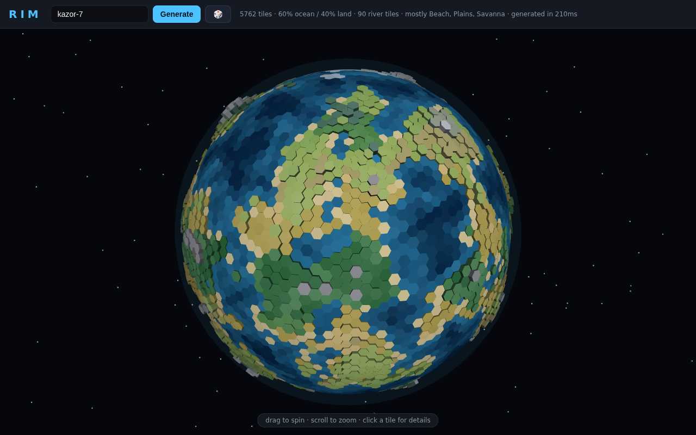

# RIM

A procedurally generated hex-tile planet, rendered as a true 3D globe in the browser.
Live at **https://rim.cbrules.com**.

Type a seed (or hit 🎲), and RIM forges a deterministic planet: ~5,800 hex tiles
wrapped around a sphere, each with elevation, climate, biome, fertility, rivers,
and resources. Drag to spin, scroll to zoom, click any tile for its full details.



## Vision

RIM is the first layer of a larger game. The planet view is the "world map";
eventually each tile will load into a full playable local map. Everything in the
generator is designed for that:

- **Determinism** — the same seed always produces the same planet, and every
  tile carries its own `tileSeed`, so a tile's detailed local map can be
  generated later, on demand, identically every time.
- **Edge cohesion** — anything that crosses tile borders (currently rivers) is
  stored *per shared edge*, guaranteed identical from both sides. When two
  adjacent tiles are loaded as playable maps, their edges will line up exactly.

## Quick start

No build step, no dependencies. Requires Node 18+.

```bash
node server.js        # serves on http://localhost:3060  (PORT env to change)
npm test              # runs geometry + worldgen invariant tests
```

That's it. The entire app is static files in `public/`; `server.js` is a
zero-dependency static file server. Three.js is vendored in `public/vendor/`
(loaded via an import map), so it works fully offline.

## How it works

### File map

```
server.js                  zero-dep static file server
test.js                    invariant tests (npm test)
public/
  index.html               app shell + import map
  style.css                dark UI theme
  js/
    sphere.js              Goldberg polyhedron geometry (the hex sphere)
    worldgen.js             ★ planet generation pipeline
    localmap.js             ★ expands one tile into a playable-scale hex map
    defs.js                 ★ biome/resource tables, colors, labels
    globe.js               Three.js renderer (tiles, rivers, picking, controls)
    terrain3d.js           Three.js landscape renderer for local tile maps
    ui.js                  tile/cell info panels + stats bar
    main.js                bootstrapping, view switching, pointer events
    rng.js                 seeded hash/PRNG (mulberry32), per-tile seeds
    noise.js               seedable 3D simplex noise
  vendor/                  three.js + OrbitControls (committed on purpose)
```

★ = where most gameplay tuning happens.

### The sphere (`sphere.js`)

You cannot tile a sphere with only hexagons. RIM uses a **Goldberg
polyhedron**: subdivide an icosahedron at frequency `f` (default 24), then take
the dual — every subdivided vertex becomes a tile. That yields `10f²+2` tiles:
all hexagons except exactly **12 pentagons** (at the original icosahedron
vertices). Each tile has:

| field       | meaning                                                        |
|-------------|----------------------------------------------------------------|
| `center`    | unit vector on the sphere                                      |
| `corners`   | polygon corners (CCW from outside), shared exactly with neighbors |
| `neighbors` | adjacent tile ids, index-aligned with edges                    |
| `edgeMid`   | midpoint of each shared edge — *identical from both tiles*     |

Want a denser planet? Change the frequency passed to `generateWorld` in
`main.js` (e.g. 32 → 10,242 tiles). Everything else adapts.

### World generation (`worldgen.js`)

Deterministic pipeline, all driven by `mulberry32(hash(seed + ':<stage>'))`:

1. **Elevation** — 3D simplex fBm sampled at each tile center: low-frequency
   continents + detail + ridged noise for mountain chains. Naturally seamless
   (no map edges, no pole distortion — it's a sphere).
2. **Sea level** — set at the 60th percentile of elevation, so planets are
   always ~60% ocean.
3. **Climate** — temperature from latitude + altitude lapse + noise; moisture
   from noise + equator boost − a dry band at ~30° latitude (real-world desert
   belts).
4. **Rivers & lakes** — springs picked in wet highlands; each river walks
   strictly downhill until it reaches the sea, merges with another river, or
   gets stuck in a depression (which becomes a lake). River crossings are
   stored as `riverN` (indices into `neighbors`) **on both tiles** — this is
   the edge-cohesion guarantee.
5. **Biomes** — Whittaker-style table over temperature/moisture/elevation:
   oceans (depth-shaded), beach, desert, steppe, savanna, grassland, plains,
   shrubland, forests (temperate/seasonal/rain), taiga, tundra, snow, glacier,
   swamp, marsh, mountain, peak, lake.
6. **Features** — coral reefs, desert oases, volcanoes, snowcaps, sea ice,
   forest cover.
7. **Fertility** — 0–100 (Barren → Lush) from biome base + moisture +
   temperature suitability + river/oasis/volcanic-soil bonuses.
8. **Resources** — ~60 types (`defs.js`) drawn from weighted tables per biome,
   plus feature tables (reef → pearls…), plus a mineral roll on hills. Resource
   rolls use the per-tile seed, so they're stable even if you reorder the code.

### Rendering (`globe.js`)

Plain Three.js, one merged `BufferGeometry` for all tiles: each tile is a
polygon cap extruded radially by elevation with darker skirt walls (the
stylized low-poly look), vertex colors (converted sRGB → linear), Lambert
shading with a camera-attached light. Rivers are thin ribbon quads from tile
center to edge midpoint — both tiles draw their half, so rivers connect
seamlessly. Picking is a raycast with a `faceIndex → tile` lookup table.

### Local tile maps (`localmap.js`, `terrain3d.js`)

Double-click a tile on the globe (or hit **Explore this tile** in its panel) to
open it as a full 3D landscape: smooth low-poly terrain with real water,
carved meandering rivers, dense instanced forests, rock piles, ore crystal
deposits, crop fields, coral reefs — and animals that wander around (deer,
sheep, cattle, foxes; fish circle in the water). The landscape floats as a
diorama with cliff edges at the tile boundary.

`localmap.js` produces two layers: a continuous `sample(x, y)` terrain field
(used by the renderer) and a hex-cell data grid sampled from the same field
(gameplay data + click-for-info). Generation is deterministic from `tileSeed` +
world seed, and cached in memory, so revisiting a tile always shows the same
map. How it stays consistent with the globe and with neighbors:

- Cell attributes are **IDW-interpolated from the tile + its globe neighbors**,
  then detailed with noise fields seeded by the *world* seed — those fields are
  continuous across the whole sphere, so terrain flows smoothly toward what the
  adjacent tile's map will contain (coastal tiles get real shorelines on the
  ocean side, snowy neighbors bleed frost over the shared edge, etc.).
- **Rivers enter/exit exactly at the globe's shared edge midpoints**
  (`tile.edgeMid`), then meander deterministically through the cells toward the
  opposite crossing, the sea, or a basin.
- Tile features materialize: volcanoes raise a cone with a crater, oases dig a
  pond ringed with palms, reefs patch the shallows, forests scatter trees by
  biome density.
- Every resource on the tile is placed as 2–4 concrete deposits in suitable
  cells (fish in water, ores on high ground, crops on fertile flats).

## Conventions

- Vanilla ES modules only — no bundler, no framework, no build step. Keep it
  that way unless there's a very strong reason.
- Everything in worldgen must stay **deterministic per seed**. Never call
  `Math.random()` in generation code; use the seeded RNGs.
- Anything that crosses a tile border must be stored per-edge on both tiles
  (follow the river pattern) so future playable maps line up.
- Run `npm test` before committing; it checks the geometry and generation
  invariants above.

## Deployment (production box)

```bash
pm2 start server.js --name rim   # runs on :3060
pm2 save
```

Public traffic reaches it through a Cloudflare Tunnel
(`rim.cbrules.com → localhost:3060` in `~/.cloudflared/config.yml`).

## Roadmap

- [x] Load a tile as a detailed local map (using `tileSeed`, matching edges)
- [ ] Travel between adjacent tile maps
- [ ] More cross-border features (roads, mountain ranges as edge data)
- [ ] Region/continent naming
- [ ] Gameplay 🙂
